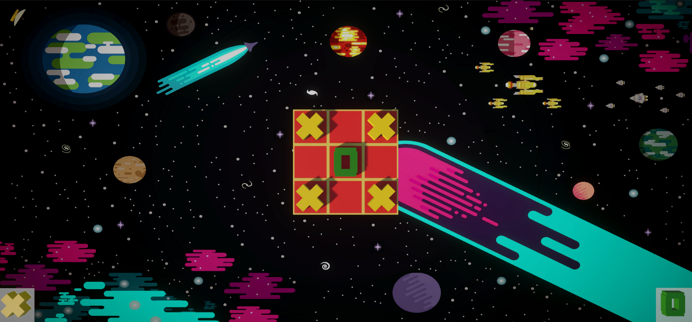

# 3D Tic Tac Toe

> Tic Tac Toe 3D game made in Unity.

## 💻 Requirements
* Unity engine version `2021.3.0f1 or newer`. It might work in older versions, but not tested.
* `Windows (10 or newer) / Linux / Mac`.

## 🚀 Installling 3D Tic Tac Toe
Just add the project to Unity HUB and use the correct version.

## ☕ Building 3D Tic Tac Toe
To build 3D Tic Tac Toe, do the following steps:

1. Ope the project with Unity
2. Access the tab `File` and click `Build and Run`

Done! You will run the application in your computer.

[⬆ Back to top](#3d-tic-tac-toe) 
